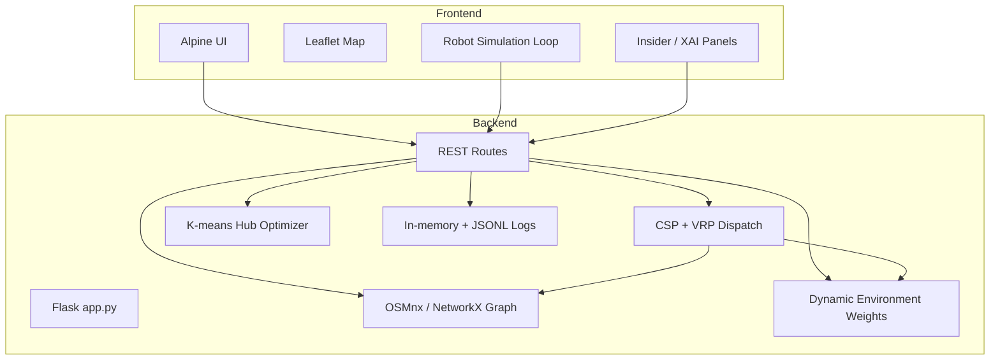
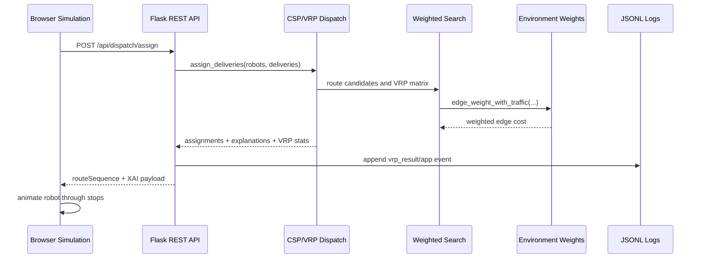

# System Architecture & Design

This document describes the current architecture of the AI Delivery Robots simulation.
The app is a single Flask process with REST APIs, an in-memory application state, and
a browser-based simulation running on Leaflet.

## System Layout



## Runtime Model

- `main.py` starts the Flask server on port `5002`.
- `delivery_robots/app.py` owns shared state, locks, graph handles, metrics, and route registration.
- The frontend owns the live robot animation loop and calls REST endpoints for routing, dispatch, logging, environment updates, and AI explanations.
- The backend owns graph search, dynamic edge weights, dispatch constraints, VRP sequencing, K-means, metrics, and persistent JSONL logging.

## Backend Components

### Graph

`delivery_robots/core/graph.py` loads the Hoan Kiem bike road graph with OSMnx, caches graph data when enabled, projects the graph, and builds a spatial nearest-node index. Nearest-node lookup prefers the `BallTree` index and falls back to OSMnx/manual Haversine logic when needed.

### Dynamic Environment

`delivery_robots/core/environment.py` computes edge traversal multipliers from:

- rush-hour traffic
- dynamic traffic routes
- rain zones
- obstacles
- robot road memory penalties

The underlying graph geometry is not mutated. Routing receives a dynamic weight function.

### Routing

`delivery_robots/algorithms/weighted_search.py` provides production A*, Dijkstra, and GBFS. `greedy` is accepted as an alias for `gbfs`.

`delivery_robots/algorithms/classical.py` keeps base-distance-only algorithms for academic comparison.

`delivery_robots/algorithms/insider.py` records step-level A* and comparison data for visualization.

### Dispatch, CSP, XAI, and VRP

`delivery_robots/algorithms/dispatch/` contains dispatch logic:

- `constraints.py`: feasibility rules for status, battery, capacity, and pickup distance.
- `allocation.py`: prioritizes orders, filters robot candidates, scores feasible candidates, and returns assignment payloads.
- `xai.py`: builds structured explanations for rejected, pruned, scored, and selected robots.
- `vrp_solver.py`: solves pickup/dropoff sequencing with Simulated Annealing while enforcing pickup-before-dropoff precedence.

The demo capacity is `3` active orders per robot. Dispatch can batch several pending deliveries onto one robot when queue pressure is higher than idle robot count.

### K-means Hubs

`delivery_robots/core/hubs.py` computes optimized charging hubs with K-means. It prefers delivery coordinates loaded from `logs/delivery-history.jsonl` and falls back to the in-memory history for the current server session when the log file is not sufficient.

### Logs and Metrics

Runtime metrics remain in memory. UI/dispatch events and delivery history are also written to JSONL files under ignored `logs/`:

- `logs/app-events.jsonl`
- `logs/delivery-history.jsonl`

## Frontend Components

The frontend is split by responsibility under `delivery_robots/static/js/`:

- `core/`: API client, app bootstrap, config, pathfinding helpers, UI helpers.
- `environment/`: rain, traffic, and obstacle controls.
- `map/`: map setup and visual layers.
- `robot/`: robot model, movement, rendering, capacity and active order display.
- `simulation/`: delivery factory, dispatch client, simulation coordinator, renderers.
- `insider/`: A* expansion view and XAI/VRP decision timeline.

Robots now support multi-stop execution through `deliveryQueue`, `routeSequence`, and `currentSequenceIndex`.

## Dynamic Weighting

Edge cost is computed as:

```text
weighted_cost = base_length
  * traffic_multiplier
  * rain_multiplier
  * obstacle_multiplier
  * memory_multiplier
```

`build_route_response` reports cost breakdown so the UI and XAI panels can explain why a route was chosen.

## Main Data Flow


