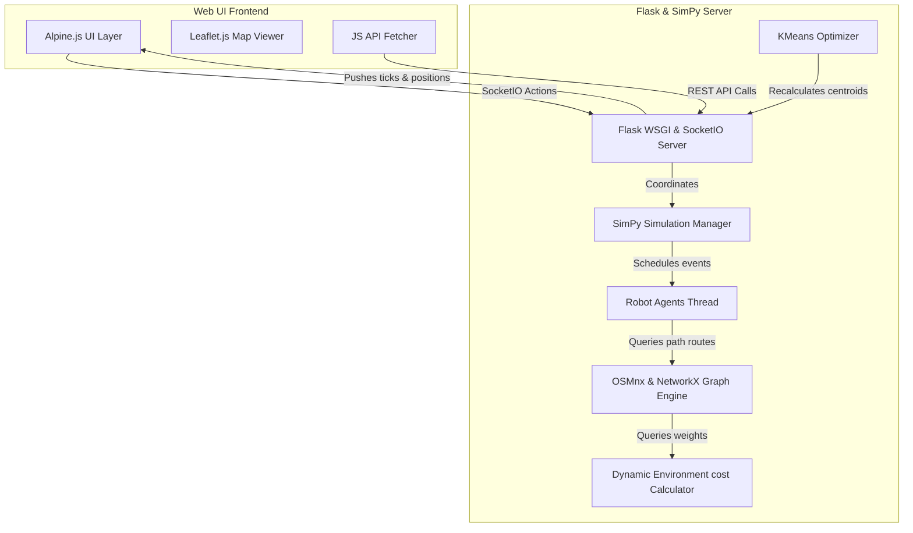
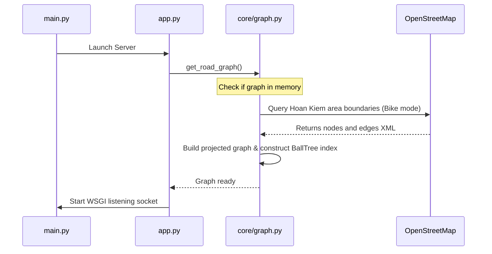

# System Architecture & System Design

This document describes the high-level system design, components, data flow, simulation loops, and dynamic weighting math for the **AI Delivery Robots Simulation** application.

---

## 🏛️ System Component Layout

The application follows an event-driven, micro-service-like component structure, although executed in a single in-memory Python process:

---

## 🧠 Core Component Specifications

1.  **Flask & WebSockets Server (`app.py`, `routes/`)**: Exposes REST interfaces to manipulate environment variables, captures logs, and handles WebSocket endpoints for starts, pauses, and resets.
2.  **OSMnx Graph Service (`core/graph.py`)**:
    *   Downloads spatial geometry for Hanoi Hoan Kiem district on initialization.
    *   Saves coordinate projections and builds a **Scikit-learn BallTree** index in radians. This allows $O(\log N)$ search speeds for identifying the closest graph node from arbitrary GPS inputs.
3.  **Dynamic Environment Engine (`core/environment.py`)**:
    *   Evaluates penalty coefficients dynamically rather than changing static graph structure values.
    *   Integrates rush-hour periods, rainfall circles, and localized obstacles into travel weights.
4.  **SimPy Simulation Coordinator (`core/simulation/`)**:
    *   Maintains the queue of pending orders.
    *   Spawns simulated order events asynchronously.
    *   Updates robot agent trajectories, manages movement phases, drains batteries, and pushes telemetry updates to SocketIO.

---

## 🔄 Data & Execution Flow

### 1. Startup & Graph Building

### 2. Multi-Agent Order Dispatching & Traversal
1.  **Order Generation**: The `SimulatorManager` runs an order generator process, appending delivery tasks to `order_queue` at random simulated time intervals.
2.  **Task Assignment**: The dispatcher selects the first order from the queue and binds it to the first idle `RobotAgent`.
3.  **Path Search**:
    *   The dispatcher queries `run_weighted_route_search` using A* from the robot's current coordinate to the pickup coordinate, and then from the pickup to the drop-off coordinate.
    *   The routing algorithm queries `edge_weight_with_traffic` for every edge traversal step.
4.  **Animation Path Building**: The server formats coordinates using `build_geometry_path` and `build_segment_geometry` so the Leaflet frontend can smoothly interpolate positions.
5.  **Agent Movement**: The agent steps through the path nodes on the SimPy timeline, waiting on timeouts scaled by edge travel weights, and depletes battery.

---

## 📈 Dynamic Weighting Mathematics

The cost to traverse any edge $E$ between node $u$ and node $v$ with base geographical length $L$ is computed dynamically using environmental penalties:

$$\text{Weight}(E) = L \times \text{Penalty}_{\text{traffic}}(\text{midpoint}) \times \text{Penalty}_{\text{rain}}(\text{midpoint}) \times \text{Penalty}_{\text{obstacle}}(\text{midpoint})$$

Where:
*   $\text{midpoint}$ is the average latitude and longitude coordinates of $u$ and $v$.

### 1. Traffic Congestion Penalty
*   **Rush Hour**: Evaluates the simulated time. If the simulated time falls in a rush period (e.g. Evening Rush 5 PM-7 PM, multiplier $M=3.0$), a wave penalty is calculated using a sine curve to smoothly interpolate congestion:
    $$\text{RushMultiplier} = 1 + (M - 1) \times \sin(\text{Progress} \times \pi)$$
*   **Localized Congestion**: Evaluates distance $D$ from the midpoint to the congestion polyline. If $D \le 24\text{ meters}$, a penalty scales up to the route severity:
    $$\text{TrafficPenalty} = 1 + \text{Severity} \times \text{SegmentStrength} \times 3.2$$

### 2. Weather Penalty (Rain Storms)
*   For each rain zone center, if distance $D$ from edge midpoint is $\le$ rain zone radius:
    $$\text{RainPenalty} = 1 + \text{Severity}$$ *(Default severity is 1.0, making the default penalty multiplier 2.0)*.

### 3. Road Obstacle Penalty (Roadblocks, Accidents)
*   For each obstacle, if distance $D$ from edge midpoint is $\le$ obstacle radius:
    $$\text{Closeness} = 1 - \frac{D}{\text{Radius}}$$
    $$\text{ObstaclePenalty} = 1 + \left(\frac{\text{Severity}}{10}\right) \times \max(0.2, \text{Closeness})$$
    *(Default severity is 10.0, so roadblocks close to centers apply up to a 2.0x multiplier).*
