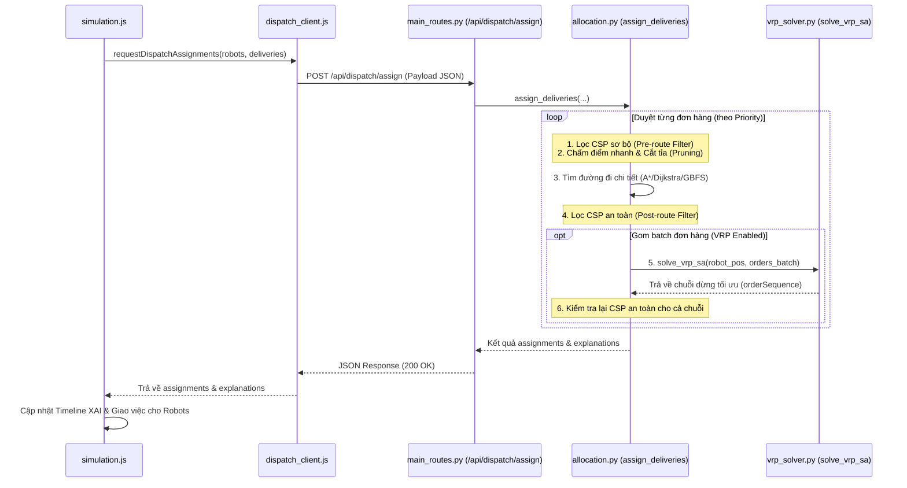

# 🔌 Hướng dẫn Giao tiếp Backend & Frontend (BE-FE Communication Guide)

Tài liệu này tổng hợp luồng giao tiếp dữ liệu giữa Backend (Flask) và Frontend (Vanilla JS, Leaflet, Alpine.js) trong hệ thống mô phỏng robot giao hàng. Hướng dẫn dành riêng cho nhà phát triển Backend để nắm bắt cấu trúc request/response, luồng dữ liệu và thiết kế API của hệ thống.

---

## 🧭 1. Mô hình Kiến trúc Giao tiếp

Hệ thống hoạt động theo mô hình **Client-Server RESTful API**:
*   **Frontend (FE)**: Làm chủ luồng thời gian thực (Simulation Loop), chịu trách nhiệm hiển thị bản đồ, vẽ lộ trình và chạy hoạt cảnh robot di chuyển.
*   **Backend (BE)**: Đóng vai trò là bộ tính toán AI phi tập trung, cung cấp các thuật toán tìm đường đắt đỏ trên đồ thị, lọc điều phối CSP, tối ưu hóa VRP và huấn luyện phân cụm K-means Hub.
*   **Helper phía FE**: Toàn bộ yêu cầu API của FE được đóng gói và gửi qua bộ API Client định nghĩa tại [api_client.js](file:///C:/Users/htran/PycharmProjects/AI-Intro/delivery_robots/static/js/core/api_client.js).

---

## 🔄 2. Sơ đồ Tuần tự Luồng Điều phối (Dispatch Flow Sequence)

Mỗi khi hệ thống mô phỏng phát hiện có robot rảnh (`idle`) và hàng đợi đơn hàng còn trống, hàm `assignDeliveries()` tại [simulation.js](file:///C:/Users/htran/PycharmProjects/AI-Intro/delivery_robots/static/js/simulation/simulation.js#L135) sẽ được kích hoạt để gọi API của BE:



---

## 🛠️ 3. Chi tiết các API Endpoint và Định dạng Payload

### 3.1. API Điều phối và Tối ưu hóa Lộ trình
*   **Endpoint**: `/api/dispatch/assign`
*   **Phương thức**: `POST`
*   **Đăng ký route**: [main_routes.py:L228](file:///C:/Users/htran/PycharmProjects/AI-Intro/delivery_robots/routes/main_routes.py#L228)

#### Payload Yêu cầu (Request Body từ FE)
FE gửi toàn bộ trạng thái Fleet robot và các đơn hàng chưa giao lên BE:
```json
{
  "robots": [
    {
      "id": 0,
      "name": "Robot-A",
      "lat": 21.0285,
      "lon": 105.8542,
      "battery": 85.0,
      "status": "idle",
      "currentLoad": 0,
      "capacity": 3,
      "roadMemory": {},
      "routeAlgorithm": "astar"
    }
  ],
  "deliveries": [
    {
      "id": 1,
      "pickup": { "lat": 21.0295, "lon": 105.8580, "name": "Vườn hoa Lý Thái Tổ" },
      "destination": { "lat": 21.0255, "lon": 105.8520, "name": "Chợ Đồng Xuân" },
      "createdAt": 1729482749321
    }
  ],
  "currentTime": 1729482750000
}
```

#### Dữ liệu trả về (Response Body từ BE)
BE trả về mảng các phép gán thành công cùng với log giải thích XAI:
```json
{
  "assignments": [
    {
      "robotId": 0,
      "robotName": "Robot-A",
      "deliveryId": 1,
      "deliveryIds": [1],
      "priorityScore": 5.2,
      "batteryRisk": 0.0,
      "totalScore": 340.5,
      "pickupName": "Vườn hoa Lý Thái Tổ",
      "destinationName": "Chợ Đồng Xuân",
      "route": {
        "path": [
          { "lat": 21.0285, "lon": 105.8542 },
          { "lat": 21.0295, "lon": 105.8580 }
        ],
        "distance": 450.2,
        "costBreakdown": {
          "baseDistance": 450.2,
          "trafficPenalty": 0.0,
          "rainPenalty": 0.0,
          "obstaclePenalty": 0.0,
          "totalCost": 450.2,
          "estimatedMinutes": 2.5
        }
      },
      "orderSequence": [
        { "stopId": "P1", "type": "pickup", "deliveryId": 1, "lat": 21.0295, "lon": 105.8580 },
        { "stopId": "D1", "type": "dropoff", "deliveryId": 1, "lat": 21.0255, "lon": 105.8520 }
      ],
      "vrpStats": null
    }
  ],
  "explanations": [
    {
      "deliveryId": 1,
      "priorityScore": 5.2,
      "candidates": [
        {
          "robotId": 0,
          "robotName": "Robot-A",
          "approximateScore": 450.2,
          "passedPreRouteConstraints": true,
          "passedPostRouteConstraints": true,
          "finalScore": 340.5,
          "decision": "selected"
        }
      ],
      "timeline": [
        { "step": "pre_route", "status": "passed", "message": "Robot-A passed feasibility checks." }
      ]
    }
  ]
}
```

---

### 3.2. API Đăng ký và Phân cụm Hubs (K-means)
Để chạy tối ưu hóa Hubs, hệ thống cần ghi nhận dữ liệu các chuyến đi lịch sử:

1.  **Đăng ký lịch sử đơn hàng (`POST /api/log_delivery`)**:
    *   *Mục đích*: Khi đơn hàng phát sinh, FE gọi API này để BE ghi tọa độ pickup/dropoff vào file `logs/delivery-history.jsonl`.
    *   *Payload*:
        ```json
        {
          "deliveryId": 1,
          "pickupLat": 21.0295, "pickupLon": 105.8580,
          "dropoffLat": 21.0255, "dropoffLon": 105.8520,
          "createdAt": 1729482749321
        }
        ```

2.  **Tối ưu hóa vị trí Hub sạc (`POST /api/optimize-hubs`)**:
    *   *Mục đích*: Chạy phân cụm K-means trên tập dữ liệu lịch sử để dời các trạm sạc về các centroid có mật độ nhu cầu cao nhất.
    *   *Payload*: Không có body.
    *   *Response*:
        ```json
        {
          "hubs": [
            { "id": 1, "lat": 21.0278, "lon": 105.8540, "name": "Hub Centroid 1" }
          ]
        }
        ```

---

### 3.3. API Quản lý Môi trường Động (Weather & Traffic)
FE gọi định kỳ các API này để đồng bộ hóa hoạt cảnh trên bản đồ Leaflet:

*   **`GET /api/weather`**: Lấy danh sách các vùng mưa (`rainZones`) hiện có trên BE để hiển thị lên bản đồ.
*   **`GET /api/traffic`**: Trả về các phân đoạn đường kẹt xe và mức độ nghiêm trọng tính toán động theo chu kỳ thời gian.
*   **`GET /api/clock`**: Trả về thời gian học thuật trong simulation và hệ số nhân phạt của giờ cao điểm (`rushHour.multiplier`).

---

### 3.4. API Logging Đồng nhất
*   **Endpoint**: `/api/logs`
*   **Đăng ký route**: [environment_routes.py:L224](file:///C:/Users/htran/PycharmProjects/AI-Intro/delivery_robots/routes/environment_routes.py#L224)
*   **Cách hoạt động**:
    *   `POST`: FE đẩy log hoạt động của robot (ví dụ: `Robot-A charging`, `Robot-B arrived`) lên BE để BE đồng bộ ghi ra file `logs/app-events.jsonl`.
    *   `GET`: FE định kỳ lấy log mới nhất về render lên giao diện nhật ký sự kiện trực quan.

---

## ⚠️ 4. Những Điểm Backend Developer Cần Lưu Ý

1.  **Dữ liệu Lộ trình (Route Payload) trả về từ Dispatch**:
    Frontend thiết kế để nhận lộ trình của **chặng đầu tiên** ngay trong response của API `/api/dispatch/assign`. BE không được trả về kết quả gán rỗng rồi bắt FE gọi thêm API `/api/route` để tìm đường, vì như vậy sẽ tạo ra "Double Route Call" làm giảm nửa hiệu năng hệ thống.
2.  **Đảm bảo Lock an toàn khi cập nhật Trạng thái trạm sạc**:
    Hàm `optimize_hubs` khi ghi đè danh sách `charging_stations` trong `app_state` bắt buộc phải khóa bằng `charging_stations_lock` để tránh tranh chấp đa luồng với các API sạc pin khác (`/api/charging-stations`):
    ```python
    with app_state["charging_stations_lock"]:
        app_state["charging_stations"].clear()
        # ... append new hubs
    ```
3.  **Hạ cấp VRP an toàn (VRP Fallback)**:
    Khi chạy SA tối ưu hóa đa đơn hàng, nếu gặp ngoại lệ hoặc không tìm được chuỗi dừng hữu hạn, hàm `assign_deliveries` trên BE cần tự động bắt ngoại lệ và hạ cấp về lộ trình giao đơn lẻ (`fallback to single order`), tránh việc ném lỗi 500 làm đứng toàn bộ simulation loop của client.
4.  **Kiểu dữ liệu tọa độ**:
    Toàn bộ tọa độ GPS trao đổi qua JSON bắt buộc phải được kiểm tra (validate) qua các hàm tiện ích trong `utils/validation.py` trước khi snap vào đồ thị giao thông để tránh lỗi `KeyError` hoặc `IndexError` khi tìm kiếm node lân cận trên đồ thị.
