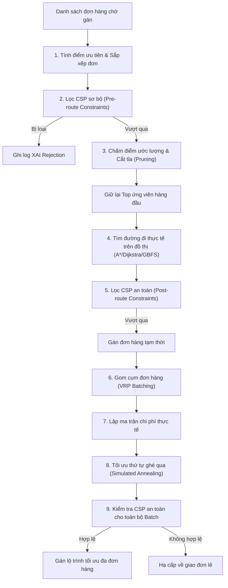

# 🚚 Hướng dẫn Toàn diện về CSP và VRP trong Dự án AI Delivery Robots

Tài liệu này cung cấp cái nhìn chi tiết, sâu sắc về kiến trúc, thuật toán và cách cài đặt thực tế của hệ thống **CSP (Constraint Satisfaction Problem - Lọc điều phối)** và **VRP/PDP (Vehicle Routing Problem / Pickup and Delivery Problem - Tối ưu hóa lộ trình)** trong dự án.

---

## 📌 1. Tổng quan Kiến trúc Bộ điều phối (Dispatch Pipeline)

Bộ điều phối đóng vai trò là "bộ não" Meso-Micro quyết định robot nào sẽ nhận đơn hàng nào, đi theo thứ tự nào để tối ưu hóa quãng đường, thời gian, và đảm bảo an toàn vận hành (pin, sức chứa).



---

## 🛡️ 2. Hệ thống CSP (Constraint Satisfaction Problem) — Bộ lọc ràng buộc

Hệ thống CSP có nhiệm vụ loại bỏ các phương án robot không khả thi nhằm đảm bảo tính an toàn cho hạm đội và giảm tải tài nguyên tính toán tìm đường đi thực tế.

Cài đặt chi tiết nằm trong file [constraints.py](file:///C:/Users/htran/PycharmProjects/AI-Intro/delivery_robots/algorithms/dispatch/constraints.py).

### 2.1. Lọc trước khi tìm đường (Pre-route Constraints)
Trước khi chạy thuật toán đồ thị phức tạp, robot ứng viên phải vượt qua hàm [evaluate_pre_route_constraints](file:///C:/Users/htran/PycharmProjects/AI-Intro/delivery_robots/algorithms/dispatch/constraints.py#L40-L91):
1.  **Trạng thái hoạt động (`idle`)**: Robot phải có trạng thái trống (`None` hoặc `idle`).
2.  **Pin hiện tại (`batteryOk`)**: Mức pin hiện tại của robot phải lớn hơn hoặc bằng mức pin tối thiểu quy định (`DISPATCH_MIN_BATTERY_PERCENT`, mặc định $20\%$).
3.  **Sức chứa trống (`capacityOk`)**: Số đơn hàng robot đang nhận (`currentLoad`) phải nhỏ hơn sức chứa tối đa của robot (`capacity`, mặc định $3$ đơn).
4.  **Khoảng cách đón hàng sơ bộ (`pickupDistanceOk`)**: Khoảng cách chim bay (Haversine) từ robot đến điểm đón hàng không vượt quá giới hạn tối đa (`DISPATCH_MAX_PICKUP_DISTANCE_METERS`, mặc định $1500$ mét).

```python
# Trích đoạn code lọc sơ bộ trong constraints.py
checks = {
    "idle": {
        "passed": status is None or status == DISPATCH_REQUIRED_ROBOT_STATUS,
        "code": "not_idle",
        "message": f"Robot status is {status}; expected idle."
    },
    "batteryOk": {
        "passed": battery >= DISPATCH_MIN_BATTERY_PERCENT,
        "code": "low_battery",
        "message": f"Battery {battery:.1f}% is below {DISPATCH_MIN_BATTERY_PERCENT}% minimum."
    },
    "capacityOk": {
        "passed": capacity is None or current_load < capacity,
        "code": "capacity_full",
        "message": f"Load {current_load}/{capacity} leaves no free capacity."
    },
    "pickupDistanceOk": {
        "passed": pickup_distance_meters <= DISPATCH_MAX_PICKUP_DISTANCE_METERS,
        "code": "pickup_too_far",
        "message": f"Pickup distance {pickup_distance_meters:.0f}m exceeds limit."
    }
}
```

### 2.2. Lọc sau khi tìm đường (Post-route Constraints)
Sau khi tính toán được đường đi thực tế trên đồ thị, hàm [evaluate_post_route_constraints](file:///C:/Users/htran/PycharmProjects/AI-Intro/delivery_robots/algorithms/dispatch/constraints.py#L100-L139) sẽ kiểm tra thêm 2 ràng buộc thực tế:
1.  **Dự trữ pin an toàn (`batteryReserveOk`)**: Tính lượng pin tiêu hao dự kiến dựa trên chiều dài lộ trình thực tế:
    $$\text{Projected Drain} = \frac{\text{Route Cost (meters)}}{1000} \times \text{Drain Rate (percent/km)}$$
    Pin dự kiến còn lại sau khi hoàn thành lộ trình phải lớn hơn hoặc bằng mức dự trữ an toàn (`DISPATCH_MIN_PROJECTED_BATTERY_PERCENT`, mặc định $10\%$).
2.  **Thời gian di chuyển thực tế (`routeEtaOk`)**: Thời gian di chuyển dự kiến (ETA) của lộ trình không được vượt quá thời gian tối đa quy định (`DISPATCH_MAX_ROUTE_ETA_MINUTES`, mặc định $30$ phút).

---

## 📦 3. Hệ thống VRP/PDP (Vehicle Routing Problem) — Tối ưu hóa lộ trình

Khi queue đơn hàng bị quá tải, bộ điều phối sẽ thực hiện ghép tối đa $3$ đơn hàng cho một robot và sử dụng thuật toán **Simulated Annealing (SA)** để tìm thứ tự ghé thăm tối ưu nhất.

Logic cốt lõi được xây dựng trong [vrp_solver.py](file:///C:/Users/htran/PycharmProjects/AI-Intro/delivery_robots/algorithms/dispatch/vrp_solver.py).

### 3.1. Ràng buộc thứ tự cứng (Precedence Constraint)
Trong bài toán Pickup and Delivery (PDP), với mỗi đơn hàng $i$, robot bắt buộc phải ghé qua điểm đón $P_i$ trước điểm giao $D_i$.
Quy tắc này được kiểm tra nghiêm ngặt trong hàm [check_precedence](file:///C:/Users/htran/PycharmProjects/AI-Intro/delivery_robots/algorithms/dispatch/vrp_solver.py#L72-L88):

```python
def check_precedence(sequence):
    picked_up = set()
    expected = {stop["deliveryId"] for stop in sequence if stop.get("type") == "pickup"}

    for stop in sequence:
        delivery_id = stop.get("deliveryId")
        if stop.get("type") == "pickup":
            if delivery_id in picked_up:
                return False  # Không được đón trùng lặp
            picked_up.add(delivery_id)
        elif stop.get("type") == "dropoff":
            if delivery_id not in expected or delivery_id not in picked_up:
                return False  # Chưa đón hàng mà đã giao -> Vi phạm!
        else:
            return False
    return True
```

### 3.2. Tiền tính toán Ma trận chi phí (`precompute_distance_matrix`)
Để thuật toán Simulated Annealing chạy trong vài mili-giây, ta không thể tìm kiếm đường đi thực tế trên đồ thị ở mỗi vòng lặp tối ưu hóa. Thay vào đó, hàm [precompute_distance_matrix](file:///C:/Users/htran/PycharmProjects/AI-Intro/delivery_robots/algorithms/dispatch/vrp_solver.py#L111-L131) sẽ lập ma trận kích thước $(2N+1) \times (2N+1)$ trước:
*   Chạy thuật toán định tuyến thực tế (A*/Dijkstra/GBFS) một lần duy nhất giữa tất cả các cặp vị trí (vị trí robot khởi hành, các điểm đón $P$, các điểm giao $D$).
*   Lưu tổng chi phí di chuyển đã có các hệ số phạt môi trường (mưa, tắc đường, vật cản, bộ nhớ tránh đường) vào ma trận.
*   Bất kỳ phép tính tổng chi phí chuỗi lộ trình nào tiếp theo chỉ mất thời gian tra cứu mảng $O(1)$.

### 3.3. Xây dựng phương án ban đầu (Initial Solution)
1.  **Lân cận gần nhất (Greedy NN)**: Hàm [greedy_initial_solution](file:///C:/Users/htran/PycharmProjects/AI-Intro/delivery_robots/algorithms/dispatch/vrp_solver.py#L134-L159) bắt đầu từ vị trí của robot, tại mỗi bước chọn điểm tiếp theo gần nhất trong số các điểm khả thi (chưa vi phạm ràng buộc thứ tự).
2.  ** DFS Nhánh cận (Branch and Bound Fallback)**: Nếu giải thuật tham lam gặp ngõ cụt do đường một chiều hoặc vật cản tạo chi phí $\infty$, hàm [_best_finite_sequence](file:///C:/Users/htran/PycharmProjects/AI-Intro/delivery_robots/algorithms/dispatch/vrp_solver.py#L162-L201) duyệt đệ quy toàn bộ các hoán vị hợp lệ và cắt tỉa nhánh kém hơn để tìm bằng được phương án có chi phí hữu hạn.

### 3.4. Tối ưu hóa bằng Simulated Annealing (SA)
Hàm [solve_vrp_sa](file:///C:/Users/htran/PycharmProjects/AI-Intro/delivery_robots/algorithms/dispatch/vrp_solver.py#L302-L367) tiến hành tối ưu chuỗi:

1.  **Biến đổi lân cận (Neighborhood Operators)**:
    Chọn ngẫu nhiên một toán tử để sinh chuỗi lộ trình mới:
    *   `swap_operator`: Đổi chỗ ngẫu nhiên hai điểm dừng.
    *   `relocate_operator`: Rút một điểm dừng ra và chèn vào vị trí khác.
    *   `two_opt_operator`: Đảo ngược thứ tự của một đoạn lộ trình con.
    *   *Kiểm tra*: Chuỗi biến đổi chỉ được giữ lại nếu vượt qua bộ lọc ràng buộc thứ tự cứng `check_precedence`.

2.  **Tiêu chuẩn chấp nhận Metropolis**:
    Tính độ chênh lệch chi phí: $\Delta E = \text{Cost}(S_{\text{candidate}}) - \text{Cost}(S_{\text{current}})$.
    *   Nếu $\Delta E \le 0$: Chấp nhận lời giải mới và cập nhật kỷ lục tốt nhất `best` (nếu có).
    *   Nếu $\Delta E > 0$: Chấp nhận lời giải mới tệ hơn với xác suất:
        $$P = e^{-\frac{\Delta E}{T}}$$
        (Nhiệt độ $T$ càng cao hoặc mức tệ hại $\Delta E$ càng nhỏ thì khả năng chấp nhận đi đường vòng càng lớn để thoát khỏi tối ưu cục bộ).

3.  **Hạ nhiệt (Cooling Schedule)**:
    Sau mỗi bước lặp cố định, nhiệt độ giảm dần theo hệ số hạ nhiệt $\alpha = 0.995$ cho tới khi chạm ngưỡng $T_{min} = 0.01$:
    $$T = T \times \alpha$$

---

## 🔗 4. Luồng Tích hợp CSP & VRP

Việc phân bổ và giải quyết đa đơn hàng được tích hợp liền mạch trong hàm [assign_deliveries](file:///C:/Users/htran/PycharmProjects/AI-Intro/delivery_robots/algorithms/dispatch/allocation.py#L433-L650) như sau:

### 4.1. Điểm ưu tiên đơn hàng & Phân loại ứng viên robot
*   Đơn hàng được tính điểm ưu tiên và sắp xếp giảm dần.
*   Với mỗi đơn hàng chưa được giao, tính điểm ước lượng nhanh cho các robot khả thi và giữ lại nhóm ứng viên tốt nhất (Top 3 hoặc Top 5).
*   Chạy tìm đường đi thực tế chi tiết trên đồ thị để chọn ra robot có điểm số tối ưu nhất (`total_score`).

### 4.2. Gom cụm và gọi tối ưu VRP
*   Khi đã chọn được robot tốt nhất cho đơn hàng ưu tiên đó, hàm [_select_vrp_batch](file:///C:/Users/htran/PycharmProjects/AI-Intro/delivery_robots/algorithms/dispatch/allocation.py#L144-L176) sẽ gom thêm tối đa $2$ đơn hàng chưa được gán khác trong hàng đợi để tạo thành một Batch tối đa $3$ đơn hàng.
*   Gọi hàm [_apply_vrp_batch_to_assignment](file:///C:/Users/htran/PycharmProjects/AI-Intro/delivery_robots/algorithms/dispatch/allocation.py#L312-L430) để xây dựng ma trận chi phí thực tế cho Batch này và giải bài toán tối ưu hóa chuỗi điểm dừng bằng Simulated Annealing.
*   Kiểm tra an toàn sau lộ trình (pin, ETA) cho toàn bộ chuỗi dừng mới. Nếu đạt yêu cầu, robot sẽ được gán chuỗi dừng tối ưu. Nếu thất bại, hệ thống tự động quay lại gán duy nhất đơn hàng ban đầu để đảm bảo an toàn.

---

## 📊 5. Bảng tổng hợp các Tham số Cấu hình chính

Các hằng số điều khiển hệ thống CSP và VRP được cấu hình tập trung trong file [config.py](file:///C:/Users/htran/PycharmProjects/AI-Intro/delivery_robots/config.py):

| Tên Tham số | Giá trị Mặc định | Ý nghĩa |
| :--- | :--- | :--- |
| `DISPATCH_MIN_BATTERY_PERCENT` | `20.0` | Pin tối thiểu để robot được đưa vào tập CSP khả thi |
| `DISPATCH_MIN_PROJECTED_BATTERY_PERCENT` | `10.0` | Pin dự phòng tối thiểu còn lại sau khi hoàn thành lộ trình |
| `DISPATCH_MAX_ROUTE_ETA_MINUTES` | `30.0` | Thời gian di chuyển thực tế tối đa được phép cho lộ trình |
| `DISPATCH_MAX_PICKUP_DISTANCE_METERS` | `1500.0` | Khoảng cách chim bay tối đa từ robot đến điểm đón hàng |
| `VRP_MAX_ORDERS_PER_ROBOT` | `3` | Sức chứa tối đa của robot (số đơn hàng gom tối đa) |
| `VRP_SA_INITIAL_TEMP` | `100.0` | Nhiệt độ bắt đầu của thuật toán Simulated Annealing |
| `VRP_SA_MIN_TEMP` | `0.01` | Nhiệt độ dừng tối ưu hóa |
| `VRP_SA_COOLING_RATE` | `0.995` | Hệ số giảm nhiệt độ sau mỗi lượt lặp |
| `VRP_SA_ITERATIONS_PER_TEMP` | `100` | Số vòng lặp sinh lân cận ở mỗi mức nhiệt độ |
| `VRP_SA_MAX_ITERATIONS` | `5000` | Số vòng lặp tối đa của toàn bộ giải thuật SA |

---

## 📈 6. Chỉ số Đánh giá Hiệu quả Vận hành (Metrics)

Hệ thống đánh giá hiệu quả của thuật toán VRP thông qua **Chỉ số hiệu quả vận hành (Efficiency Score)** hiển thị trên UI:
$$\text{Efficiency Score} = \frac{\text{Số đơn hoàn thành}}{\text{Distance (Km)} + 0.02 \times \text{Time (ms)} + 0.005 \times \text{Nodes Explored} + 0.5 \times \text{Reroutes} + 1}$$

*   **Tác dụng của VRP**: Bằng cách ghép các đơn hàng gần nhau và tối ưu hóa thứ tự ghé điểm, VRP giúp giảm đáng kể tổng quãng đường (`Distance_Km`) và số chặng di chuyển không tải (deadhead travel), qua đó cải thiện vượt bậc chỉ số hiệu quả này so với phương pháp giao đơn lẻ truyền thống.
