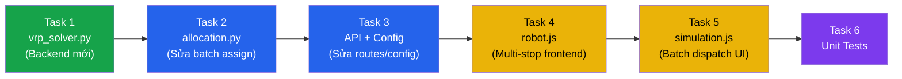

# 📋 Implementation Plan — VRP/TSP với Simulated Annealing

> Status: implemented in the current codebase. This file is kept as a planning and
> traceability reference. The active implementation lives in
> `delivery_robots/algorithms/dispatch/vrp_solver.py`,
> `delivery_robots/algorithms/dispatch/allocation.py`,
> frontend robot/simulation modules, and `tests/test_vrp.py`.

> Kế hoạch triển khai tính năng Vehicle Routing Problem cho dự án AI Delivery Robots.

---

## Tổng quan



---

## Task 1: Tạo SA Engine — `vrp_solver.py` ⭐ Core

**File:** `delivery_robots/algorithms/dispatch/vrp_solver.py` (TẠO MỚI)

**Nội dung cần code:**

| Hàm | Input | Output | Mô tả |
|-----|-------|--------|--------|
| `solve_vrp_sa()` | robot_pos, orders[], dist_matrix, sa_params | optimized_sequence[] | Vòng lặp SA chính |
| `greedy_initial_solution()` | robot_pos, stops[], dist_matrix | sequence[] | Nearest Neighbor có precedence |
| `precompute_distance_matrix()` | graph, points[], weight_fn, algo | dict[dict] | Cache cost giữa mọi cặp điểm |
| `sequence_cost()` | sequence[], dist_matrix | float | Tổng cost của 1 route |
| `check_precedence()` | sequence[] | bool | Kiểm tra pickup trước dropoff |
| `swap_operator()` | sequence[] | sequence[] | Hoán đổi 2 vị trí |
| `relocate_operator()` | sequence[] | sequence[] | Di dời 1 node |
| `two_opt_operator()` | sequence[] | sequence[] | Đảo ngược 1 đoạn |

**Tham số SA (config mặc định):**
- `T_initial = 500`, `T_min = 0.01`, `cooling_rate = 0.995`
- `iterations_per_temp = 50`, `max_iterations = 5000`

**Chú ý:**
- Hàm `precompute_distance_matrix` gọi `run_weighted_route_search` với **cùng `algo`** mà robot đang dùng (A\*, Dijkstra, GBFS, hoặc TBD)
- Mỗi operator phải gọi `check_precedence` — nếu vi phạm thì skip
- Trả về cả `sa_stats` (iterations, improvements, final_temp) để log/XAI

---

## Task 2: Sửa Allocation — Batch Assign

**File:** `delivery_robots/algorithms/dispatch/allocation.py` (SỬA)

**Thay đổi:**

| Hiện tại | Sau khi sửa |
|----------|-------------|
| Mỗi robot nhận **1 đơn** | Mỗi robot nhận tối đa **N đơn** (configurable) |
| Trả về `route` (1 pickup→1 dropoff) | Trả về `route_sequence` (multi-stop) |
| Gán greedy: delivery cao nhất → robot gần nhất | Gán batch → gọi `solve_vrp_sa()` để tối ưu thứ tự |

**Logic mới:**
```
1. Tính priorityScore cho tất cả deliveries (giữ nguyên)
2. Sort deliveries theo priority (giữ nguyên)  
3. MỚI: Gán nhiều đơn cho mỗi robot (batching)
   - Mỗi robot nhận tối đa MAX_ORDERS_PER_ROBOT đơn
   - Ràng buộc: battery đủ cho cả batch
4. MỚI: Gọi solve_vrp_sa() cho từng robot
5. Trả về assignments[] với route_sequence thay vì route đơn
```

**Giữ nguyên:**
- `calculate_priority_score()` — không đổi
- `edge_weight_with_memory()` — không đổi
- Logic battery risk — mở rộng cho tổng batch

---

## Task 3: API + Config

### 3a. Config — `delivery_robots/config.py` (SỬA)

Thêm constants mới:
```python
# ── VRP / Simulated Annealing ──
VRP_MAX_ORDERS_PER_ROBOT = 3
VRP_SA_INITIAL_TEMP = 500
VRP_SA_MIN_TEMP = 0.01
VRP_SA_COOLING_RATE = 0.995
VRP_SA_ITERATIONS_PER_TEMP = 50
VRP_SA_MAX_ITERATIONS = 5000
VRP_MIN_ORDERS_FOR_SA = 2  # dưới 2 đơn thì không cần SA
```

### 3b. Main Routes — `delivery_robots/routes/main_routes.py` (SỬA)

- Endpoint `POST /api/dispatch/assign` — cập nhật response format:
  - Thêm field `orderSequence` (thứ tự pickup/dropoff)
  - Thêm field `vrpStats` (SA metrics: iterations, improvements)
  - Giữ backward compatible: nếu robot chỉ nhận 1 đơn → format cũ

### 3c. Algorithms Init — `delivery_robots/algorithms/__init__.py` (SỬA)

Export thêm `solve_vrp_sa` nếu cần gọi trực tiếp.

---

## Task 4: Frontend Robot — Multi-stop Sequence

**File:** `delivery_robots/static/js/robot.js` (SỬA)

**Thay đổi chính:**

| Hiện tại | Sau khi sửa |
|----------|-------------|
| `currentDelivery` = 1 delivery | `deliveryQueue` = mảng deliveries |
| `deliveryPhase` = `to_pickup` hoặc `to_dropoff` | `routeSequence` = mảng stops [{type, order_id, lat, lon}] |
| `arriveAtWaypoint()` chỉ xử lý 1 stop | `arriveAtWaypoint()` pop từ queue, build route đến stop tiếp theo |

**Chi tiết sửa:**

1. **Thêm properties mới:**
   ```javascript
   this.deliveryQueue = [];        // mảng các delivery đang giữ
   this.routeSequence = [];        // mảng stops từ SA
   this.currentSequenceIndex = 0;  // đang ở stop nào
   ```

2. **Sửa `assignDelivery()`:**
   - Nhận `orderSequence[]` từ backend thay vì 1 route
   - Lưu vào `deliveryQueue` và `routeSequence`
   - Build route đến stop đầu tiên trong sequence

3. **Sửa `arriveAtWaypoint()`:**
   - Khi đến stop hiện tại:
     - Nếu `type === 'pickup'` → log "picked up order #X"
     - Nếu `type === 'dropoff'` → hoàn thành delivery, xóa markers
   - Tăng `currentSequenceIndex`
   - Nếu còn stop tiếp → build route đến stop tiếp
   - Nếu hết sequence → `IDLE`

4. **Sửa `finishCharging()`:**
   - Resume từ stop hiện tại trong sequence (không chỉ pickup/dropoff)

---

## Task 5: Frontend Simulation — Batch Dispatch

**File:** `delivery_robots/static/js/simulation.js` (SỬA)

**Thay đổi:**

1. **`assignDeliveries()`:**
   - Gửi **nhiều pending deliveries** cho mỗi robot (thay vì chỉ gán 1:1)
   - Xử lý response mới: mỗi assignment có `orderSequence`
   - Xóa nhiều deliveries khỏi `pendingDeliveries` một lúc

2. **`updateRobotStatus()`:**
   - Hiển thị thêm: "📦 Carrying 3 orders | Next: Pickup #7"
   - Hiển thị current sequence index / total stops

3. **`updateLatestDecision()`:**
   - Hiển thị SA stats: iterations, improvements, initial vs final cost
   - Hiển thị route sequence visual: `P1 → P3 → D1 → P2 → D3 → D2`

4. **Config:** Thêm vào `config.js`:
   ```javascript
   VRP: {
       MAX_ORDERS_PER_ROBOT: 3,
       ENABLED: true
   }
   ```

---

## Task 6: Unit Tests

**File:** `delivery_robots/tests/test_vrp.py` (TẠO MỚI)

| Test | Mô tả |
|------|--------|
| `test_check_precedence_valid` | Sequence hợp lệ → True |
| `test_check_precedence_invalid` | Dropoff trước pickup → False |
| `test_greedy_initial_solution` | Nearest neighbor trả về sequence hợp lệ |
| `test_swap_operator` | Swap 2 vị trí và check kết quả |
| `test_relocate_operator` | Relocate 1 node và check kết quả |
| `test_solve_vrp_sa_simple` | 2 đơn hàng, verify cost giảm |
| `test_solve_vrp_sa_single_order` | 1 đơn → trả sequence [P1, D1] nguyên gốc |
| `test_sequence_cost` | Verify tổng cost chính xác |

---

## Thứ tự triển khai

```mermaid
gantt
    title Thứ tự triển khai VRP
    dateFormat X
    axisFormat %s
    
    section Backend
    Task 1 - vrp_solver.py (SA engine)     :t1, 0, 3
    Task 2 - allocation.py (batch assign)  :t2, after t1, 2
    Task 3 - API + Config                  :t3, after t2, 1
    
    section Frontend
    Task 4 - robot.js (multi-stop)         :t4, after t3, 3
    Task 5 - simulation.js (batch UI)      :t5, after t4, 2
    
    section Testing
    Task 6 - Unit tests                    :t6, after t1, 2
```



> [!IMPORTANT]
> **Task 1 (vrp_solver.py)** là nền tảng — mọi thứ phụ thuộc vào nó. Nên bắt đầu từ đây.

---

## Files tổng kết

| File | Hành động | Dòng ảnh hưởng (ước tính) |
|------|-----------|---------------------------|
| `algorithms/dispatch/vrp_solver.py` | **TẠO MỚI** | ~200 dòng |
| `algorithms/dispatch/allocation.py` | SỬA | ~50 dòng thêm/sửa |
| `algorithms/__init__.py` | SỬA | ~3 dòng |
| `config.py` | SỬA | ~10 dòng thêm |
| `routes/main_routes.py` | SỬA | ~15 dòng |
| `static/js/robot/robot.js` | SỬA | ~80 dòng thêm/sửa |
| `static/js/simulation/simulation.js` | SỬA | ~40 dòng thêm/sửa |
| `static/js/core/config.js` | SỬA | ~5 dòng thêm |
| `tests/test_vrp.py` | **TẠO MỚI** | ~120 dòng |
