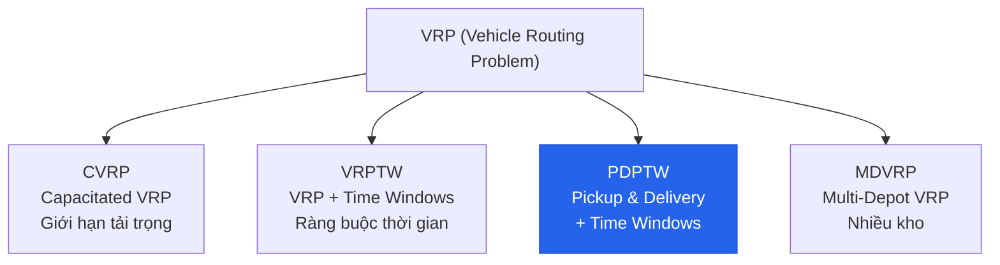
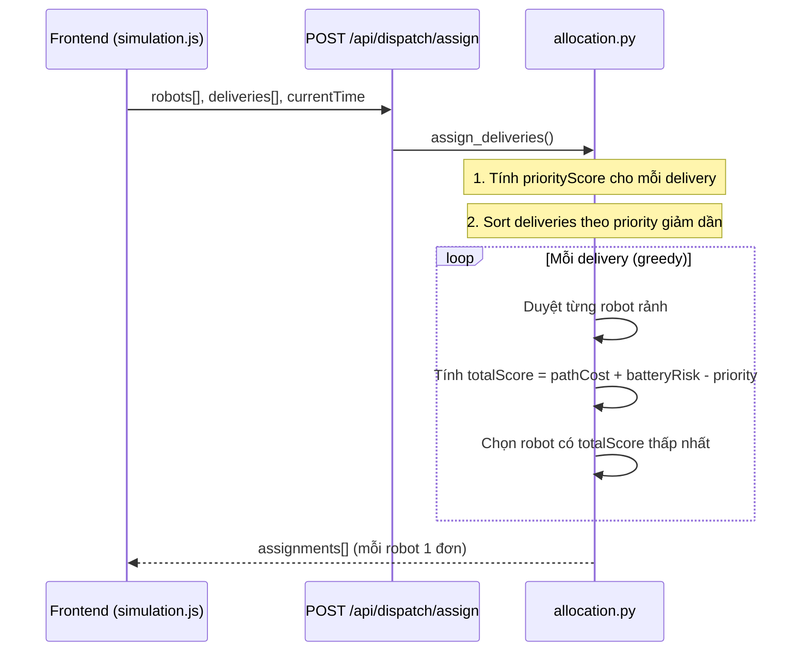
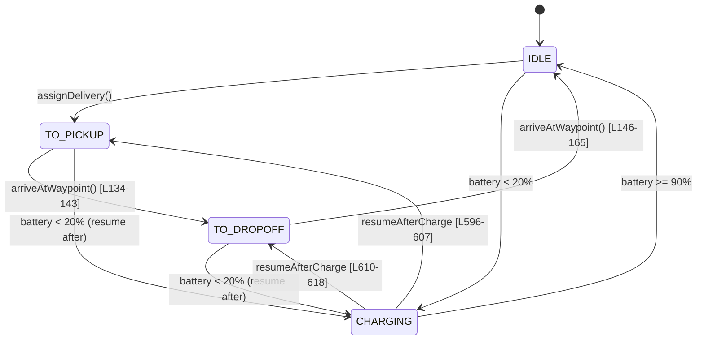
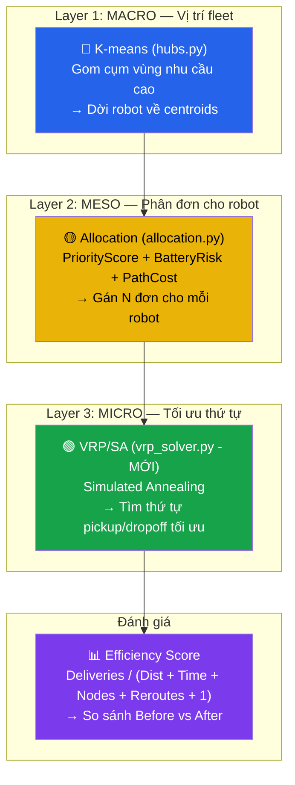

# 🚚 Nghiên cứu VRP — Vehicle Routing Problem

> Tài liệu tìm hiểu VRP/TSP + Simulated Annealing, gắn với bối cảnh dự án **AI Delivery Robots - Hoàn Kiếm**.
> Tham chiếu trực tiếp đến code hiện có.

---

## 1. Bức tranh toàn cảnh: TSP → VRP → PDP

### 1.1. TSP — Traveling Salesman Problem (Bài toán Người bán hàng)

| Yếu tố | Mô tả |
|---------|-------|
| Đầu vào | 1 xe, N điểm cần ghé |
| Mục tiêu | Tìm thứ tự ghé thăm **tất cả** N điểm **đúng 1 lần** sao cho tổng quãng đường **ngắn nhất** |
| Độ phức tạp | **NP-hard** — N! hoán vị, brute-force bất khả thi khi N lớn |

**Ví dụ trong dự án:** Một robot nhận 5 đơn hàng → phải tìm thứ tự giao 5 đơn sao cho tổng quãng đường ngắn nhất. Đây chính là TSP.

### 1.2. VRP — Vehicle Routing Problem

VRP là **tổng quát hoá** của TSP:

| Yếu tố | TSP | VRP |
|---------|-----|-----|
| Số xe | 1 | Nhiều (fleet) |
| Ràng buộc | Không | Capacity, Time Window, Pin... |
| Mục tiêu | Min tổng đường đi 1 xe | Min tổng đường đi **cả đội** |

**Các biến thể VRP phổ biến:**



### 1.3. PDP — Pickup and Delivery Problem (Biến thể của dự án)

Trong dự án, mỗi đơn hàng có **2 điểm**: pickup và dropoff. Đây chính là **PDP** với ràng buộc:

> **Ràng buộc tiên quyết (Precedence Constraint):** Với mọi đơn hàng $i$, robot **phải ghé pickup_i TRƯỚC dropoff_i**.

Ràng buộc thực tế trong code:
- **Battery constraint** — `robot.battery` giới hạn pin, dưới 20% phải sạc ([robot.js:L115](file:///c:/Users/htran/PycharmProjects/AI-Intro/delivery_robots/static/js/robot.js#L115))
- **Dynamic environment** — penalty từ traffic/rain/obstacle thay đổi trọng số đồ thị ([environment.py](file:///c:/Users/htran/PycharmProjects/AI-Intro/delivery_robots/core/environment.py))

---

## 2. Hệ thống hiện tại — Phân tích code có sẵn

### 2.1. Luồng gán đơn hiện tại ([allocation.py](file:///c:/Users/htran/PycharmProjects/AI-Intro/delivery_robots/algorithms/dispatch/allocation.py))



**Hạn chế hiện tại:** Mỗi robot chỉ nhận **1 đơn duy nhất** mỗi lần gán:

```
Robot A ← Đơn 1 (pickup → dropoff) → rảnh → lấy Đơn 2 → rảnh → Đơn 3
```

### 2.2. Delivery lifecycle trên Frontend ([robot.js](file:///c:/Users/htran/PycharmProjects/AI-Intro/delivery_robots/static/js/robot.js))



> [!IMPORTANT]
> Robot hiện chỉ có 2 phase: `to_pickup` → `to_dropoff`. Với VRP nhiều đơn, cần mở rộng thành chuỗi: `to_pickup_1` → `to_pickup_3` → `to_dropoff_1` → `to_pickup_2` → ...

### 2.3. Hai hệ thống đã có sẵn — lợi thế lớn cho VRP

#### 🔵 K-means Hub Optimization ([hubs.py](file:///c:/Users/htran/PycharmProjects/AI-Intro/delivery_robots/core/hubs.py))

K-means **đã giải quyết bài toán macro-level**: gom cụm vùng có mật độ đơn hàng cao → dời robot về vị trí tối ưu.

```python
# hubs.py — gom cụm delivery_history thành k centroids
kmeans = KMeans(n_clusters=cluster_count, n_init=10, random_state=42)
kmeans.fit(data)  # data = tất cả tọa độ pickup + dropoff lịch sử
```

**Kết nối với VRP:**

| Layer | Module | Vai trò |
|-------|--------|---------|
| **Macro** (Vị trí fleet) | K-means (`hubs.py`) | Robot **đứng ở đâu** để gần vùng nhu cầu |
| **Meso** (Phân đơn) | Allocation (`allocation.py`) | Robot **nào** nhận đơn **nào** |
| **Micro** (Thứ tự) | **VRP/SA (MỚI)** | Robot đã nhận N đơn → đi **thứ tự nào** |

→ VRP **bổ sung hoàn hảo** cho K-means: K-means quyết định robot đứng đâu, VRP quyết định robot đi thế nào.

#### 🟢 Efficiency Score ([simulation.js:L452-460](file:///c:/Users/htran/PycharmProjects/AI-Intro/delivery_robots/static/js/simulation.js#L452-L460))

Hàm `calculateEfficiencyScore` **đã có sẵn** để đo hiệu quả hoạt động:

```javascript
// simulation.js
calculateEfficiencyScore(stats) {
    const totalPathCostKm = stats.totalPathCost / 1000;
    const avgTimeMs = stats.routeCount > 0 ? stats.totalRouteTimeMs / stats.routeCount : 0;
    const avgNodes = stats.routeCount > 0 ? stats.totalNodesExplored / stats.routeCount : 0;

    const weights = CONFIG.SIMULATION.EFFICIENCY_WEIGHTS;
    // weights = { TIME: 0.02, NODES: 0.005, REROUTE: 0.5 }
    const denominator = totalPathCostKm + (weights.TIME * avgTimeMs) 
                      + (weights.NODES * avgNodes) + (weights.REROUTE * stats.rerouteCount) + 1;
    return stats.deliveriesCompleted / denominator;
}
```

**Công thức README:**
```
Score = Deliveries / (Distance_Km + 0.02*Time_ms + 0.005*Nodes_Explored + 0.5*Reroutes + 1)
```

**Kết nối với VRP:**
- Efficiency score chính là **thước đo Before/After** khi bật VRP
- VRP giảm `Distance_Km` (tổng quãng đường) → tăng `Score`
- VRP giảm `Reroutes` (lộ trình tối ưu hơn → ít phải reroute) → tăng `Score`
- Có thể dùng luôn score này làm **cost function** cho SA (tối đa hoá score = tối thiểu hoá mẫu số)

---

## 3. Simulated Annealing (SA) — Thuật toán lõi

### 3.1. Ý tưởng

SA lấy cảm hứng từ **quá trình ủ kim loại** trong luyện kim:

| Luyện kim | SA |
|-----------|-----|
| Kim loại nóng → nguyên tử dao động mạnh | T cao → chấp nhận cả lời giải tệ hơn (exploration) |
| Từ từ hạ nhiệt → nguyên tử ổn định | T giảm dần → chỉ chấp nhận lời giải tốt hơn (exploitation) |
| Kết quả: cấu trúc tinh thể bền vững | Kết quả: lời giải gần tối ưu toàn cục |

**Tại sao không dùng Greedy?** Greedy luôn chọn bước tốt nhất ngay → dễ kẹt ở **local optimum**. SA đôi khi chấp nhận lời giải tệ hơn để thoát khỏi cực trị cục bộ.

### 3.2. Công thức chấp nhận (Metropolis Criterion)

$$P(\text{accept}) = \begin{cases} 1 & \text{nếu } \Delta E \leq 0 \text{ (tốt hơn)} \\ e^{-\Delta E / T} & \text{nếu } \Delta E > 0 \text{ (tệ hơn)} \end{cases}$$

- $\Delta E = \text{Cost}(S_{\text{new}}) - \text{Cost}(S_{\text{current}})$
- Khi $T$ **cao**: $e^{-\Delta E / T} \approx 1$ → gần như chấp nhận mọi thứ
- Khi $T$ **thấp**: $e^{-\Delta E / T} \approx 0$ → chỉ chấp nhận tốt hơn

### 3.3. Pseudocode (gắn vào dự án)

```text
Algorithm: SA_for_DeliveryRobot

Input:  robot_position        // vị trí hiện tại của robot
        orders[]              // N đơn hàng, mỗi đơn có {pickup, dropoff}
        weight_fn(a, b)       // edge_weight_with_traffic (đã có trong environment.py)
Output: optimized_sequence[]  // thứ tự ghé thăm tối ưu

1.  // Tạo mảng tất cả các điểm cần ghé
    stops = []
    for each order in orders:
        stops.append( {type: 'pickup',  order_id, lat, lon} )
        stops.append( {type: 'dropoff', order_id, lat, lon} )

2.  // Greedy initial solution (Nearest Neighbor)
    S_current = nearest_neighbor_with_precedence(robot_position, stops)
    S_best = S_current

3.  // Cache distance matrix (giảm gọi pathfinding)
    dist_matrix = precompute_pairwise_costs(robot_position, stops, weight_fn)

4.  T = 500               // Initial temperature
    α = 0.995             // Cooling rate
    T_min = 0.01

5.  WHILE T > T_min:
6.      for i in range(iterations_per_temp):
7.          // Chọn random operator
8.          operator = random_choice([swap, relocate, 2_opt])
9.          S_neighbor = operator(S_current)
10.         
11.         // Kiểm tra precedence constraint
12.         IF violates_precedence(S_neighbor):
13.             CONTINUE   // pickup phải trước dropoff cho mọi order
14.         
15.         ΔE = cost(S_neighbor, dist_matrix) - cost(S_current, dist_matrix)
16.         
17.         IF ΔE < 0:
18.             S_current = S_neighbor
19.             IF cost(S_current) < cost(S_best):
20.                 S_best = S_current
21.         ELSE IF random() < exp(-ΔE / T):
22.             S_current = S_neighbor
23.     
24.     T = T × α
25. 
26. RETURN S_best
```

---

## 4. Neighborhood Operators — Cách sinh lời giải lân cận

### 4.1. Swap (Hoán đổi)

Chọn 2 vị trí → đổi chỗ:

```text
Trước: [P1, P3, D1, P2, D3, D2]
                ↕           ↕
Sau:   [P1, P3, D2, P2, D3, D1]   ← Check: D1 vẫn sau P1? D2 vẫn sau P2?
```

### 4.2. Relocate (Di dời)

Lấy 1 node ra → chèn vào vị trí khác:

```text
Trước: [P1, P3, D1, P2, D3, D2]
              ↑  bỏ D1 ra
Sau:   [P1, P3, P2, D3, D1, D2]
                          ↑  chèn D1 vào đây
```

### 4.3. 2-opt (Đảo ngược đoạn)

Đảo ngược thứ tự một đoạn:

```text
Trước: [P1, P3, D1, P2, D3, D2]
              |←  reverse  →|
Sau:   [P1, D3, P2, D1, P3, D2]
```

> [!WARNING]
> Mọi operator phải **kiểm tra precedence** sau khi biến đổi. Nếu `dropoff_i` đứng trước `pickup_i` → **từ chối** neighbor này.

---

## 5. Cooling Schedule — Tham số khuyến nghị

| Tham số | Giá trị | Lý do |
|---------|---------|-------|
| $T_0$ | 500–1000 | Đủ cao để khám phá tự do ban đầu |
| $T_{min}$ | 0.01–1 | Đủ thấp để hội tụ |
| $\alpha$ | 0.995 | Hạ chậm → chất lượng tốt |
| Iterations/T | 50–100 | Đủ mẫu ở mỗi mức nhiệt |
| Max iterations | 5000–10000 | Cân bằng chất lượng vs thời gian |

> [!TIP]
> Với N đơn hàng nhỏ (2-5 đơn/robot), SA hội tụ rất nhanh. Có thể dùng T₀=200, α=0.99, max_iter=2000.

---

## 6. Cost Function — Tận dụng infrastructure có sẵn

### 6.1. Hàm weight đã có

```python
# environment.py:L116 — hàm tổng hợp penalty
def edge_weight_with_traffic(state, from_node, to_node, edge_data):
    penalty = traffic_penalty * rain_penalty * obstacle_penalty
    return edge_length * penalty
```

### 6.2. Pathfinding algorithm-agnostic

VRP/SA **không phụ thuộc** vào thuật toán tìm đường cụ thể. Hệ thống hiện hỗ trợ:

| Thuật toán | Đặc điểm | Khi nào dùng |
|------------|----------|-------------|
| **A\*** | Tối ưu + heuristic | Cân bằng tốc độ & chất lượng |
| **Dijkstra** | Tối ưu, không heuristic | Đảm bảo đường ngắn nhất tuyệt đối |
| **GBFS** | Nhanh, greedy heuristic | Ưu tiên tốc độ tính toán |
| **TBD** | _Sẽ chỉ định sau_ | — |

```python
# allocation.py:L52 — robot tự chọn algorithm
algo = robot.get('routeAlgorithm', 'astar')  # astar | dijkstra | gbfs | ...
route_nodes, nodes_explored = run_weighted_route_search(
    graph, start_node, end_node, ..., weight_fn, algo
)
```

Khi SA cần tính cost giữa 2 điểm, nó gọi `run_weighted_route_search` với **cùng algorithm** mà robot đang dùng. Nhờ vậy:
- VRP route tối ưu cho A\* robot ≠ VRP route tối ưu cho Dijkstra robot
- Efficiency Score so sánh công bằng giữa các algorithm

### 6.3. Hàm cost cho VRP sequence

```python
def sequence_cost(robot_pos, sequence, dist_matrix):
    """
    Tính tổng cost từ robot → stop_0 → stop_1 → ... → stop_N
    Dùng pre-computed dist_matrix để tra cứu O(1)
    """
    total = dist_matrix[robot_pos][sequence[0]]  # robot → first stop
    for i in range(len(sequence) - 1):
        total += dist_matrix[sequence[i]][sequence[i+1]]
    return total
```

### 6.4. Pre-compute Distance Matrix

Gọi pathfinding cho mỗi cặp điểm tốn kém → cache trước (dùng cùng `algo` với robot):

```python
def precompute_distance_matrix(graph, all_points, weight_fn, nearest_node_fn, algo='astar'):
    """
    all_points = [robot_pos, P1, D1, P2, D2, ...]
    algo = robot.routeAlgorithm (astar | dijkstra | gbfs | ...)
    Trả về dict-of-dict: matrix[A][B] = path_cost(A→B)
    """
    matrix = {}
    nodes = {p: nearest_node_fn(graph, p.lat, p.lon) for p in all_points}
    
    for a in all_points:
        matrix[a] = {}
        for b in all_points:
            if a == b:
                matrix[a][b] = 0
                continue
            path, _ = run_weighted_route_search(
                graph, nodes[a], nodes[b], b.lat, b.lon, weight_fn, algo
            )
            matrix[a][b] = sum_path_cost(graph, path, weight_fn)
    
    return matrix
```

> [!TIP]
> Với N đơn hàng, có 2N+1 điểm (robot + N pickup + N dropoff), cần tính (2N+1)² path.
> Với N=3 → chỉ 49 path, rất nhanh. N=5 → 121 path, vẫn chấp nhận được.

---

## 7. Tích hợp 3 tầng: K-means → Allocation → VRP



---

## 8. Luồng đề xuất — Trước vs Sau VRP

### TRƯỚC (hiện tại)

```
assignDeliveries() → mỗi robot nhận 1 đơn
→ robot A: pickup1 → dropoff1 → IDLE → pickup2 → dropoff2 → IDLE → ...
                                  ↑ deadhead travel ↑
```

### SAU (với VRP)

```
assignDeliveries() → mỗi robot nhận N đơn (batch)
→ vrp_solver → tối ưu thứ tự bằng SA
→ robot A: pickup1 → pickup3 → dropoff1 → pickup2 → dropoff3 → dropoff2
                     ↑ không deadhead, liên tục di chuyển ↑
```

### Các file cần tạo/sửa

| Hành động | File | Mô tả |
|-----------|------|-------|
| **TẠO MỚI** | `algorithms/dispatch/vrp_solver.py` | SA engine: input N đơn → output optimized sequence |
| **SỬA** | `algorithms/dispatch/allocation.py` | Gán nhiều đơn/robot, gọi `vrp_solver` |
| **SỬA** | `routes/main_routes.py` | API trả về multi-stop route |
| **SỬA** | `static/js/robot.js` | Robot xử lý sequence nhiều stop (mở rộng `arriveAtWaypoint`) |
| **SỬA** | `static/js/simulation.js` | Frontend gửi batch orders, hiển thị VRP info |
| **TẠO MỚI** | `tests/test_vrp.py` | Unit tests cho SA solver |

---

## 9. Bảng tổng hợp khái niệm AI

| Khái niệm | Giải thích | Module trong dự án |
|------------|------------|---------------------|
| **K-means Clustering** | Gom cụm không giám sát, tìm centroids | `hubs.py` — tối ưu vị trí robot |
| **TSP** | Tìm thứ tự ghé N điểm ngắn nhất | Tối ưu route 1 robot |
| **VRP/PDP** | TSP + nhiều xe + pickup/delivery | `vrp_solver.py` (sẽ tạo) |
| **Simulated Annealing** | Metaheuristic tránh local optima | Thuật toán giải VRP |
| **Metropolis Criterion** | $P = e^{-\Delta E / T}$ | Cơ chế exploration của SA |
| **Neighborhood Operators** | Swap, Relocate, 2-opt | Cách sinh lời giải lân cận |
| **Precedence Constraint** | Pickup phải trước Dropoff | Ràng buộc cứng của PDP |
| **Efficiency Score** | $\frac{Deliveries}{Dist + Time + ...}$ | `simulation.js` — đánh giá Before/After |
| **Multi-Algorithm Search** | A\*, Dijkstra, GBFS, TBD | `weighted_search.py` — robot tự chọn algo |
| **Road Memory (RL-lite)** | Robot ghi nhớ đường chậm | `robot.js` — penalty nhân vào edge weight |
| **Dynamic Edge Weight** | Trọng số cạnh thay đổi theo traffic/rain | `environment.py` |

---

## 10. Tài liệu tham khảo

- [Wikipedia — Vehicle Routing Problem](https://en.wikipedia.org/wiki/Vehicle_routing_problem)
- [Wikipedia — Simulated Annealing](https://en.wikipedia.org/wiki/Simulated_annealing)
- [Google OR-Tools — Pickup & Delivery](https://developers.google.com/optimization/routing/pickup_delivery)
- [CP-Algorithms — Simulated Annealing](https://cp-algorithms.com/combinatorics/simulated_annealing.html)
